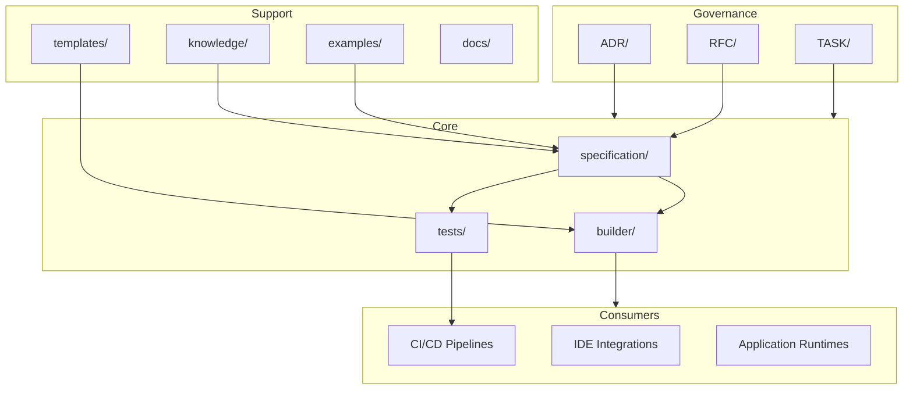

# Architecture

This document describes the architectural model of **APS SDK** (Avangard Prompt Specification SDK).

## Design Principles

1. **Specification-first** — The normative specification in `specification/` is the single source of truth. All tooling derives from it.
2. **Separation of concerns** — Specification, tooling, knowledge, and templates are independent layers with explicit contracts.
3. **Governed evolution** — Changes to the specification require RFC review; architectural decisions require ADRs.
4. **Testable conformance** — Every normative requirement must be verifiable through automated tests in `tests/`.
5. **Industrial readiness** — The SDK is designed for long-term maintenance, versioning, and multi-team collaboration.

## Repository Layout

```
.
├── ADR/              Architecture Decision Records
├── RFC/              Specification change proposals
├── TASK/             Tracked work items
├── builder/          SDK build and code generation tooling
├── docs/             Supplementary documentation
├── examples/         Reference usage examples
├── knowledge/        Domain knowledge and reference material
├── specification/    Normative APS specification artifacts
├── templates/        Authoring scaffolds
└── tests/            Conformance and regression tests
```

Root-level documents (`README.md`, `ARCHITECTURE.md`, `ROADMAP.md`, `CONTRIBUTING.md`, `CHANGELOG.md`) provide project-wide context. Each directory contains a `README.md` describing its purpose, responsibility, expected contents, and relationships.

## System Context



## Component Boundaries

### Governance

| Directory | Responsibility | Expected Contents |
|-----------|---------------|-------------------|
| `ADR/` | Record irreversible architectural decisions | Numbered ADR documents |
| `RFC/` | Propose and review specification changes | Numbered RFC documents |
| `TASK/` | Track implementation work with acceptance criteria | Numbered task documents |

### Core

| Directory | Responsibility | Expected Contents |
|-----------|---------------|-------------------|
| `specification/` | Define normative APS language, schema, semantics, versioning | Specification artifacts (Phase 1) |
| `builder/` | Validate inputs and generate distributable SDK artifacts | Build pipeline, CLI, API (Phase 2) |
| `tests/` | Verify conformance against the normative specification | Schema, semantic, builder, regression tests (Phase 3) |

### Support

| Directory | Responsibility | Expected Contents |
|-----------|---------------|-------------------|
| `templates/` | Provide authoring scaffolds for specification and governance documents | Structural templates (Phase 4) |
| `knowledge/` | Host non-normative reference material | Glossaries, domain mappings, guides (Phase 4) |
| `examples/` | Illustrate correct usage without defining requirements | Sample artifacts and patterns (Phase 4) |
| `docs/` | Supplement root documentation with detailed guides | Authoring, builder, testing, migration guides |

## Dependency Flow

```
RFC/ ──proposes──▶ specification/ ──consumed by──▶ builder/
                         │                              │
                         ├──validated by──▶ tests/       ├──output──▶ consumers
                         │
templates/ ──scaffolds──▶ specification/
knowledge/ ──informs──▶  specification/
examples/ ──illustrates ▶ specification/

ADR/ ──governs──▶ all layers
TASK/ ──tracks──▶ all layers
```

## Foundation Stage Constraints

At the current foundation stage, the repository contains **infrastructure only**:

| Excluded | Reason |
|----------|--------|
| APS YAML specification files | Specification content begins in Phase 1 |
| Builder implementation | Tooling begins in Phase 2 |
| Conformance tests | Test suite begins in Phase 3 |
| DSL runtime | Out of SDK scope |
| Rule engine | Out of SDK scope |
| Prompt content | Out of SDK scope |

## Versioning Strategy

APS SDK follows [Semantic Versioning](https://semver.org/):

- **MAJOR** — Breaking changes to the normative specification
- **MINOR** — Backward-compatible specification additions
- **PATCH** — Bug fixes, documentation, and non-normative updates

Specification versions and SDK package versions are aligned but tracked independently.

## Extension Points

Future integrations (IDE plugins, language server, package registries) consume the builder output API. Extension contracts will be defined in `specification/` as the SDK matures.
