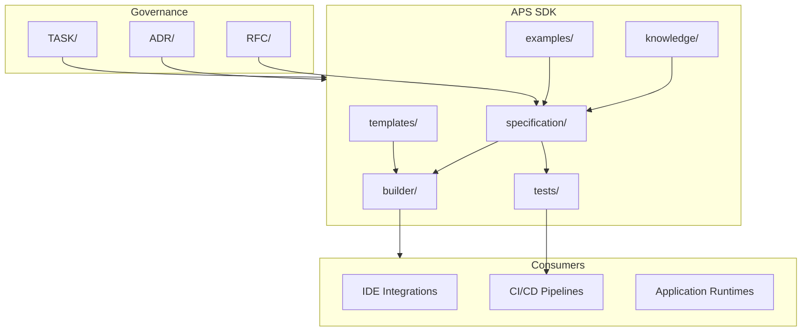

# Architecture

This document describes the architectural model of **APS SDK** (Avangard Prompt Specification SDK).

## Design Principles

1. **Specification-first** — The normative specification in `specification/` is the single source of truth. All tooling derives from it.
2. **Separation of concerns** — Specification, tooling, knowledge, and templates are independent layers with explicit contracts.
3. **Governed evolution** — Changes to the specification require RFC review; architectural decisions require ADRs.
4. **Testable conformance** — Every normative requirement must be verifiable through automated tests in `tests/`.
5. **Industrial readiness** — The SDK is designed for long-term maintenance, versioning, and multi-team collaboration.

## System Context

## Component Boundaries

### `specification/`

Normative artifacts that define the APS language, schema, semantics, and versioning rules. This layer contains no executable code.

**Responsibilities:**

- Define the formal grammar and data model
- Document semantic rules and constraints
- Maintain version compatibility matrix

**Must not contain:** Builder logic, runtime implementations, or domain-specific business rules.

### `builder/`

Tooling that consumes the specification and produces validated artifacts (schemas, parsers, generators).

**Responsibilities:**

- Parse and validate specification inputs
- Generate distributable SDK packages
- Provide CLI and programmatic APIs

**Must not contain:** Normative specification text or conformance test definitions.

### `templates/`

Canonical scaffolds for authoring specification-compliant documents. Templates are structural; they do not embed domain logic.

### `knowledge/`

Non-normative reference material: glossaries, integration guides, domain mappings. Content here does not override the specification.

### `examples/`

Illustrative, non-normative examples of specification artifacts and SDK usage patterns. Examples support adoption but do not define requirements.

### `tests/`

Conformance suite that validates specification compliance across builder outputs and reference implementations.

**Test categories:**

| Category | Purpose |
|----------|---------|
| Schema validation | Structural correctness of specification artifacts |
| Semantic validation | Behavioral correctness against normative rules |
| Builder integration | End-to-end build pipeline verification |
| Regression | Protection against unintended breaking changes |

### `docs/`

Supplementary documentation that supports adoption but is not part of the normative specification.

## Governance Layers

| Layer | Location | Purpose |
|-------|----------|---------|
| RFC | `RFC/` | Propose and review specification changes |
| ADR | `ADR/` | Record irreversible architectural decisions |
| TASK | `TASK/` | Track implementation work with acceptance criteria |

## Versioning Strategy

APS SDK follows [Semantic Versioning](https://semver.org/):

- **MAJOR** — Breaking changes to the normative specification
- **MINOR** — Backward-compatible specification additions
- **PATCH** — Bug fixes, documentation, and non-normative updates

Specification versions and SDK package versions are aligned but tracked independently.

## Extension Points

Future integrations (IDE plugins, language server, package registries) consume the builder output API. Extension contracts will be defined in `specification/` as the SDK matures.
