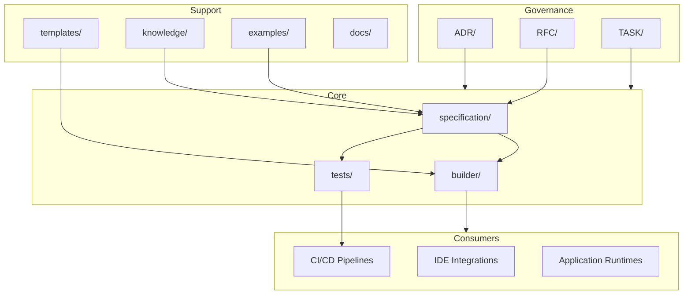

# APS SDK

**Avangard Prompt Specification SDK** — an open specification and tooling framework for defining, validating, and building structured prompt systems at industrial scale.

## Vision

APS SDK treats prompts as engineered artifacts. The project provides:

- A **formal specification** for describing prompt systems with precision
- **Build tooling** that validates and generates distributable artifacts
- A **conformance suite** that enforces specification compliance
- **Governance processes** for controlled, multi-team evolution

APS SDK is not a prompt library, a DSL runtime, a rule engine, or a collection of pre-built prompts. It is the infrastructure layer on which those systems are built.

## Architecture



## Repository Structure

```
.
├── ADR/              Architecture Decision Records
├── RFC/              Specification change proposals
├── TASK/             Tracked work items
├── builder/          SDK build and code generation tooling
├── docs/             Supplementary documentation
├── examples/         Reference usage examples
├── knowledge/        Domain knowledge and reference material
├── specification/    Normative APS specification artifacts
├── templates/        Authoring scaffolds
└── tests/            Conformance and regression tests
```

## Components

| Component | Purpose |
|-----------|---------|
| [`specification/`](specification/) | Normative APS specification — grammar, schema, semantics, versioning |
| [`builder/`](builder/) | Validates specification inputs and generates distributable SDK artifacts |
| [`tests/`](tests/) | Conformance and regression tests against the normative specification |
| [`templates/`](templates/) | Canonical scaffolds for authoring specification-compliant documents |
| [`knowledge/`](knowledge/) | Non-normative reference: glossaries, guides, domain mappings |
| [`examples/`](examples/) | Illustrative examples of specification artifacts and SDK usage |
| [`docs/`](docs/) | Supplementary documentation for adopters and maintainers |
| [`ADR/`](ADR/) | Architecture Decision Records for irreversible design choices |
| [`RFC/`](RFC/) | Specification change proposals reviewed before merge |
| [`TASK/`](TASK/) | Scoped work items with acceptance criteria |

## Development Workflow

| Step | Action |
|------|--------|
| 1 | Create a branch from `develop` using the naming convention in [CONTRIBUTING.md](CONTRIBUTING.md) |
| 2 | For specification changes, submit an RFC in `RFC/` before modifying `specification/` |
| 3 | For architectural decisions, record an ADR in `ADR/` |
| 4 | Track implementation work with a TASK document in `TASK/` |
| 5 | Open a pull request against `develop` and address review feedback |
| 6 | Merge after maintainer approval |

Branch strategy: `main` (stable) ← `develop` (integration) ← `feature/*`, `fix/*`, `rfc/*`, `adr/*`.

## Roadmap

Development follows a phased plan documented in [ROADMAP.md](ROADMAP.md):

| Phase | Focus | Status |
|-------|-------|--------|
| 0 | Project foundation | Completed |
| 1 | Specification core | Planned |
| 2 | Builder tooling | Planned |
| 3 | Conformance suite | Planned |
| 4 | Templates and knowledge base | Planned |
| 5 | First public release | Planned |

## Documentation

| Document | Description |
|----------|-------------|
| [ARCHITECTURE.md](ARCHITECTURE.md) | System architecture and component boundaries |
| [ROADMAP.md](ROADMAP.md) | Release planning and milestone timeline |
| [CONTRIBUTING.md](CONTRIBUTING.md) | Contribution workflow and governance |
| [CHANGELOG.md](CHANGELOG.md) | Version history |

## License

License terms will be defined prior to the first public release.
