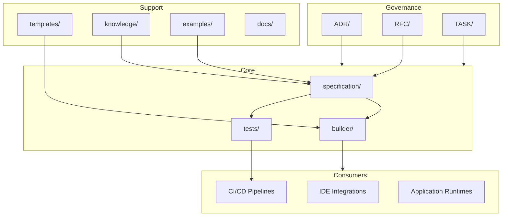

# APS SDK

**Avangard Prompt Specification SDK** — an open specification and tooling framework for defining, validating, and building structured prompt systems at industrial scale.

APS SDK is not a prompt library. It is a development platform: a formal specification, reference implementations, validation tooling, and governance processes for teams that treat prompts as engineered artifacts.

## Architecture



## Components

| Component | Description |
|-----------|-------------|
| [`specification/`](specification/) | Normative APS specification — grammar, schema, semantics, and versioning rules |
| [`builder/`](builder/) | Build tooling that validates inputs and generates distributable SDK artifacts |
| [`tests/`](tests/) | Conformance and regression tests against the normative specification |
| [`templates/`](templates/) | Canonical scaffolds for authoring specification-compliant documents |
| [`knowledge/`](knowledge/) | Non-normative reference material: glossaries, guides, domain mappings |
| [`examples/`](examples/) | Illustrative examples of specification artifacts and SDK usage patterns |
| [`docs/`](docs/) | Supplementary documentation for adopters and maintainers |
| [`ADR/`](ADR/) | Architecture Decision Records for irreversible design choices |
| [`RFC/`](RFC/) | Specification change proposals reviewed before merge |
| [`TASK/`](TASK/) | Scoped work items with acceptance criteria |

## Repository Structure

```
.
├── ADR/              Architecture Decision Records
├── RFC/              Specification change proposals
├── TASK/             Tracked work items
├── builder/          SDK build and code generation tooling
├── docs/             Supplementary documentation
├── examples/         Reference usage examples
├── knowledge/        Domain knowledge and reference material
├── specification/    Normative APS specification artifacts
├── templates/        Authoring scaffolds
└── tests/            Conformance and regression tests
```

## Documentation

| Document | Description |
|----------|-------------|
| [ARCHITECTURE.md](ARCHITECTURE.md) | System architecture and component boundaries |
| [ROADMAP.md](ROADMAP.md) | Release planning and milestone timeline |
| [CONTRIBUTING.md](CONTRIBUTING.md) | Contribution workflow and governance |
| [CHANGELOG.md](CHANGELOG.md) | Version history |

## Getting Started

1. Read [ARCHITECTURE.md](ARCHITECTURE.md) to understand component boundaries.
2. Review the [ROADMAP.md](ROADMAP.md) for the current development phase.
3. Follow [CONTRIBUTING.md](CONTRIBUTING.md) before submitting changes.

## License

License terms will be defined prior to the first public release.
